# Tavily Search MCP Server — Claude Desktop Guide

Use this guide to connect the Tavily Search MCP server to **Claude Desktop** on macOS — locally (Docker or Python) or remotely on a cloud VM.

## Architecture

### Local Mode (stdio)


### Cloud Mode (SSE over HTTP)

```mermaid
graph LR
    subgraph Your Machine
        Claude[Claude Desktop]
    end
    subgraph Cloud VM ["Cloud VM (CLOUD_IP)"]
        Server[mcp-search-agent :8080]
    end
    subgraph External
        Tavily[Tavily API]
    end

    Claude <-->|"Streamable HTTP · http://CLOUD_IP:8080/mcp"| Server
    Server <-->|HTTPS| Tavily
```



## Request Flow


## Prerequisites

- **Tavily API Key** — Get one free at [tavily.com](https://tavily.com/)
- **Claude Desktop** — [Download](https://claude.ai/download) and install

## Setup Options


---

## Option 1: Local Docker (Recommended)

Uses `Dockerfile.local` and `mcp_search_server_local.py` — a minimal stdio-only image with no exposed ports.

### 1. Build the Local Docker Image

```bash
cd search_agent
docker build -f Dockerfile.local -t mcp-search-agent-local .
```

Or use the Makefile:

```bash
make build-local
```

### 2. Configure Claude Desktop

Open the Claude Desktop config file:

```bash
code ~/Library/Application\ Support/Claude/claude_desktop_config.json
```

Add the following (replace the API key with your own):

```json
{
  "mcpServers": {
    "search-agent": {
      "command": "docker",
      "args": [
        "run",
        "-i",
        "--rm",
        "-e",
        "TAVILY_API_KEY=tvly-YOUR_API_KEY_HERE",
        "mcp-search-agent-local"
      ]
    }
  }
}
```

### 3. Restart Claude Desktop

Quit Claude Desktop (`Cmd + Q`) and reopen it. The MCP server will appear in the tools menu (hammer icon).

---

## Option 2: Local Python

### 1. Install Dependencies

Requires **Python 3.12+**.

```bash
cd search_agent
pip install -r requirements.txt
```

This installs:
- `mcp[cli]` — MCP server framework
- `tavily-python` — Tavily API client

### 2. Set Your API Key

Export the key in your shell (or rely on the default key in the script):

```bash
export TAVILY_API_KEY=tvly-YOUR_API_KEY_HERE
```

### 3. Configure Claude Desktop

Open the config file:

```bash
code ~/Library/Application\ Support/Claude/claude_desktop_config.json
```

Add the following (adjust paths to match your system):

```json
{
  "mcpServers": {
    "search-agent": {
      "command": "python3",
      "args": [
        "/Users/YOUR_USERNAME/../mcp_search_server_local.py"
      ],
      "env": {
        "TAVILY_API_KEY": "tvly-YOUR_API_KEY_HERE"
      }
    }
  }
}
```

> **Note:** Use the full absolute path to `mcp_search_server_local.py`. Claude Desktop does not expand `~` or relative paths.

### 4. Restart Claude Desktop

Quit (`Cmd + Q`) and reopen. The server will be available.

---

## Option 3: Cloud VM Deployment

Deploy the MCP server to a remote VM so Claude Desktop connects over the network via SSE.

### Deployment Flow


### 1. Build the Docker Image (locally)

```bash
cd search_agent
make build
```

### 2. Deploy to the VM

**Option A — Using the Makefile (one command):**

```bash
make deploy CLOUD_IP=user@1.2.3.4 TAVILY_API_KEY=tvly-YOUR_KEY
```

This will:
1. Save the Docker image to a tarball
2. Upload it to the VM via `scp`
3. Load it into Docker on the VM
4. Start the container on port 8080

**Option B — Manual steps:**

```bash
# Save and upload the image
docker save mcp-search-agent | gzip > /tmp/mcp-search-agent.tar.gz
scp /tmp/mcp-search-agent.tar.gz user@CLOUD_IP:/tmp/

# SSH into the VM and start the container
ssh user@CLOUD_IP
docker load < /tmp/mcp-search-agent.tar.gz
docker run -d --name mcp-search-agent --restart unless-stopped \
  -p 8080:8000 \
  -e TAVILY_API_KEY=tvly-YOUR_KEY \
  mcp-search-agent --transport streamable-http
```

### 3. Open Firewall Port

Ensure port **8080** is open on your cloud VM's firewall / security group:

| Cloud Provider | Command / Setting |
|----------------|-------------------|
| **AWS** | Security Group → Inbound → TCP 8080 |
| **GCP** | `gcloud compute firewall-rules create allow-mcp --allow tcp:8080` |
| **Azure** | NSG → Inbound → TCP 8080 |
| **Generic** | `sudo ufw allow 8080/tcp` |

### 4. Verify the Server Is Running

From your local machine:

```bash
curl http://CLOUD_IP:8080/mcp
```

You should see an HTTP response (it will hang open — that's correct). Press `Ctrl+C` to stop.

### 5. Configure Claude Desktop

Open the config file:

```bash
code ~/Library/Application\ Support/Claude/claude_desktop_config.json
```

Add the remote server (replace `CLOUD_IP` with your VM's actual IP address):

```json
{
  "mcpServers": {
    "search-agent": {
      "url": "http://CLOUD_IP:8080/mcp"
    }
  }
}
```

> **Note:** For remote servers, you only need the `url` field — no `command` or `args`.

### 6. Restart Claude Desktop

Quit (`Cmd + Q`) and reopen.

### Managing the Cloud Server

```bash
# Check status
ssh user@CLOUD_IP "docker ps | grep mcp-search-agent"

# View logs
ssh user@CLOUD_IP "docker logs -f mcp-search-agent"

# Stop the server
ssh user@CLOUD_IP "docker stop mcp-search-agent && docker rm mcp-search-agent"

# Restart the server
ssh user@CLOUD_IP "docker restart mcp-search-agent"
```

---

## Verifying the Connection

After restarting Claude Desktop:

1. Open a new conversation
2. Look for the **hammer icon** (🔨) in the input area — it indicates MCP tools are available
3. Click the hammer to confirm `tavily_search` is listed
4. Test with a prompt:
   ```
   Search for "latest developments in quantum computing"
   ```

Claude will call the `tavily_search` tool and return summarized results.

## Tool Reference

| Tool | Parameters | Description |
|------|-----------|-------------|
| `tavily_search` | `query` (string, required) | Search the web using Tavily |
| | `search_depth` (string, optional) | `"basic"` or `"advanced"` (default: `"advanced"`) |

## Troubleshooting

### Server not appearing in Claude Desktop


### Check Claude Desktop Logs

```bash
# View MCP-related logs
tail -f ~/Library/Logs/Claude/mcp*.log
```

### Common Issues

| Problem | Cause | Fix |
|---------|-------|-----|
| Tool not listed | Config not loaded | Restart Claude Desktop (`Cmd + Q`) |
| Docker error | Image not built | Run `docker build -t mcp-search-agent .` |
| API errors | Invalid Tavily key | Verify key at [tavily.com](https://tavily.com/) |
| Python not found | Wrong path in config | Use full absolute path to `python3` and script |
| Permission denied | Script not executable | Run `chmod +x mcp_search_server.py` |
| Cloud: connection refused | Firewall blocking port | Open port 8080 in security group / `ufw` |
| Cloud: connection timeout | Wrong IP or server not running | Verify with `curl http://CLOUD_IP:8080/mcp` |

### Test the Server Manually

**Local Docker (stdio):**
```bash
echo '{"jsonrpc":"2.0","id":1,"method":"initialize","params":{"capabilities":{}}}' | docker run -i --rm -e TAVILY_API_KEY=tvly-YOUR_KEY mcp-search-agent-local
```

**Local Python (stdio):**
```bash
echo '{"jsonrpc":"2.0","id":1,"method":"initialize","params":{"capabilities":{}}}' | python3 mcp_search_server_local.py
```

**Cloud Docker (Streamable HTTP):**
```bash
curl http://CLOUD_IP:8080/mcp
```

For stdio modes, you'll see a JSON response with server capabilities. For HTTP, a hanging connection confirms the server is live.

---

## File Overview

| File | Purpose |
|------|---------|
| `mcp_search_server_local.py` | Local MCP server — stdio only, minimal |
| `mcp_search_server.py` | Cloud MCP server — stdio + streamable-http transport |
| `Dockerfile.local` | Local Docker image — stdio, no exposed ports |
| `Dockerfile` | Cloud Docker image — exposes port 8000 (mapped to 8080 on host) |
| `Makefile` | `build-local`, `run-local`, `build`, `deploy`, etc. |
| `tavily_client.py` | Standalone Tavily client (for testing) |
| `requirements.txt` | Python dependencies |
| `test_mcp_server.sh` | Automated diagnostic script |
| `claude_readme.md` | This guide — Claude Desktop setup (local + cloud) |
